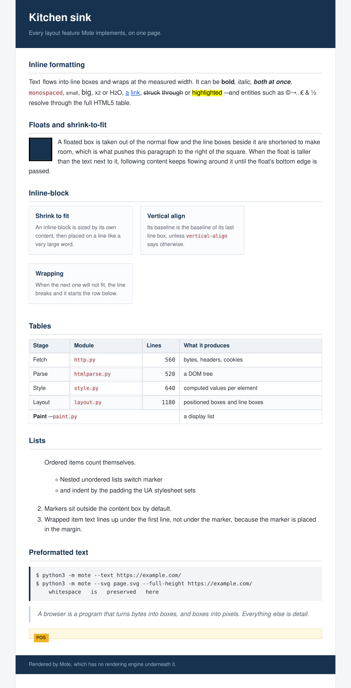

# Mote — a web browser from scratch

Mote is a web browser written in pure Python, from the socket up. It opens its
own TCP connections and writes HTTP/1.1 by hand, parses HTML and CSS itself,
runs its own cascade, lays out its own boxes, decodes its own PNGs, GIFs and
JPEGs, and paints the result into a window.

There is no rendering engine underneath it. No `requests`, no `html.parser`,
no `cssselect`, no Pillow, no WebKit. **The only dependency is the Python
standard library** — `socket`, `ssl`, `zlib` and `tkinter` — and each of those
is used strictly as a pipe, a cipher, a DEFLATE codec and a canvas.

About 9,000 lines of engine and 1,300 lines of tests.



*That image is not a screenshot of another browser. It is SVG emitted by
Mote's own painter from Mote's own layout — `python3 -m mote --svg out.svg
examples/kitchen-sink.html`. More in the [gallery](docs/gallery.html).*

## Run it

Needs Python 3.9 or newer. Nothing to install.

```bash
git clone https://github.com/ctbot000/web-browser-from-scratch.git
cd web-browser-from-scratch
python3 -m mote https://example.com/
```

That opens the window: address bar, tabs, history, clickable links, scrolling,
zoom. If your Python has no `tkinter`, everything else still works.

```bash
# Render a page as text in your terminal
python3 -m mote --text https://info.cern.ch/hypertext/WWW/TheProject.html

# ...in colour, at a chosen width
python3 -m mote --text --color --columns 100 https://news.ycombinator.com/

# Render a page to SVG, the whole document rather than one viewport
python3 -m mote --svg page.svg --full-height https://example.com/

# Look inside the engine at any stage
python3 -m mote --dump headers  https://example.com/   # the HTTP exchange
python3 -m mote --dump dom      https://example.com/   # the parsed tree
python3 -m mote --dump css      https://example.com/   # computed styles
python3 -m mote --dump layout   https://example.com/   # the box tree
python3 -m mote --dump display  https://example.com/   # the display list
python3 -m mote --dump errors   https://example.com/   # parse errors recovered from
```

Local files and `about:` pages work too: `python3 -m mote examples/kitchen-sink.html`,
`python3 -m mote about:features`.

Keys in the window: `Ctrl+L` address bar, `Alt+←`/`Alt+→` history, `Ctrl+R`
reload, `Ctrl+T`/`Ctrl+W` tabs, `Ctrl+U` view source, `Ctrl+±` zoom, `Space`
and `Page Up`/`Page Down` to scroll.

## How a page becomes pixels

Each stage is a module you can read on its own, and every stage can be dumped
from the command line.

| Stage | Module | What it turns into |
| --- | --- | --- |
| Resolve the address | [`url.py`](mote/url.py) | RFC 3986 parsing and reference resolution |
| Open the connection | [`http.py`](mote/http.py) | HTTP/1.1 written onto a socket by hand |
| Decide what the bytes mean | [`encoding.py`](mote/encoding.py) | text, via BOM / header / `<meta charset>` sniffing |
| Parse the markup | [`htmlparse.py`](mote/htmlparse.py) → [`dom.py`](mote/dom.py) | a DOM tree, however broken the input |
| Parse the CSS | [`csstoken.py`](mote/csstoken.py) → [`cssparse.py`](mote/cssparse.py) | rules, selectors and declarations |
| Run the cascade | [`selectors.py`](mote/selectors.py) + [`style.py`](mote/style.py) | one computed style per element |
| Build and size the boxes | [`layout.py`](mote/layout.py) | a box tree with positions and line boxes |
| Paint | [`paint.py`](mote/paint.py) | a flat display list |
| Draw | [`backends/`](mote/backends) | a Tk window, a terminal, or SVG |

The display list is the seam that makes the three backends possible: it is a
list of `DrawRect`, `DrawBorder`, `DrawText`, `DrawImage` and `DrawLine`
commands in paint order, and nothing in it knows what a window is.

Text measurement is abstracted the same way ([`fonts.py`](mote/fonts.py)).
The window measures with real Tk font metrics; headless rendering measures
with built-in advance-width tables for the PostScript core fonts, which land
within a few per cent of the real thing and, more usefully, are identical on
every machine — so layout tests are deterministic.

## What it does

**Network.** HTTP/1.1 written directly onto a socket, TLS through the
platform trust store, keep-alive with a connection pool, chunked transfer
coding, `gzip` and `deflate`, redirects with correct method rewriting, a
cookie jar with domain/path/`Secure` matching, and a cache that honours
`max-age`, `Expires`, `ETag` and `Last-Modified`. Schemes: `http`, `https`,
`file`, `data`, `about`, `view-source`.

**HTML.** A tokenizer and tree builder with the recovery rules real pages
need: implied end tags, automatic `html`/`head`/`body`, elements that may not
nest, raw-text elements, implicit `tbody`, and table text lifted out to where
it belongs. All 2,231 named character references, with the standard's
longest-match rule — `&notit;` is `¬it;`, not an error.

**CSS.** A Syntax Level 3 tokenizer; the full selector grammar including
combinators, attribute operators, structural pseudo-classes and `:not()`;
specificity and the cascade across origins with `!important`; inheritance and
computed values; `@media` and `@import`; shorthand expansion; `calc()`; and
colours in every notation (`#abc`, `#rrggbbaa`, `rgb()`, `hsl()`, 148 named
colours).

**Layout.** Block and inline formatting, line breaking, collapsing margins,
floats with line-box avoidance and `clear`, shrink-to-fit, `inline-block`,
automatic table layout with `colspan`, list markers (`disc` through
`lower-roman`), `relative` and `absolute` positioning, `box-sizing`, and the
`white-space` modes.

**Images.** PNG, GIF, JPEG, BMP and PNM decoders written on `zlib` alone —
PNG with every colour type, bit depth and Adam7 interlacing; GIF including its
LZW stream; baseline JPEG with Huffman decoding, dequantisation, IDCT and
chroma upsampling. The JPEG decoder agrees with the system decoder to a mean
of 0.56/255 per channel. They exist because Tk 8.5 can display only GIF and
PPM, and nothing in the standard library decodes a PNG.

## What it does not do

Stated plainly, because a browser's limits matter more than its features:

- **No JavaScript.** Pages render as their markup describes them. A site that
  paints itself from an empty `<div id="root">` shows an empty page.
- **No flexbox or grid.** They fall back to block layout, which usually means
  a column instead of a row.
- **HTTP/1.1 only** — no HTTP/2 or HTTP/3, and no Brotli, so `Accept-Encoding`
  advertises only what it can actually decode.
- No forms submission, no `border-radius`, shadows, transforms, animations,
  filters or SVG rendering. They parse and are ignored.
- No incremental rendering: a page is fetched, laid out and painted in full.

It renders [the first web page](https://info.cern.ch/hypertext/WWW/TheProject.html),
Hacker News, `example.com`, Dan Luu's blog and most documentation sites
legibly. It does not render Gmail.

## Tests

```bash
python3 -m unittest discover -s tests -t .
```

146 tests, well under a second, no network access. They cover the normative
RFC 3986 resolution examples, the tokenizer and its recovery rules, selector
matching and specificity, the cascade, layout geometry, the image decoders
against fixtures this project did not write, and the HTTP client against a
server that runs in-process and deliberately writes awkward responses —
chunked bodies, a body with no `Content-Length`, a redirect loop, a `304`.

They earn their keep. Writing them turned up four real bugs: `<br>` never
broke a line because it was not in the replaced-element set; an
`inline-block` child put its parent into block formatting, so cards stacked
instead of flowing; `position: absolute` was not blockified and was dropped
entirely inside inline content; and `localhost:8000` in the address bar parsed
`localhost` as a URL scheme.

## Layout

```
mote/
├── url.py  http.py  encoding.py  resource.py   the network
├── dom.py  htmlparse.py  entities.py           the markup
├── csstoken.py  cssparse.py  selectors.py      the style sheets
├── values.py  style.py  ua.css                 the cascade
├── fonts.py  layout.py  paint.py               boxes and the display list
├── images/   png.py  gif.py  jpeg.py  bmp.py   the decoders
├── backends/ tkgui.py  textout.py  svgout.py   the three ways to draw
└── browser.py  about.py  __main__.py           the engine and the CLI
```

`ua.css` is worth a look on its own: it is the default stylesheet, the
hundred-odd lines that turn a bare DOM into something that reads like a
document.

## Licence

MIT. See [LICENSE](LICENSE).
